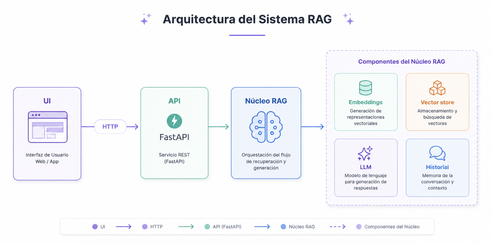
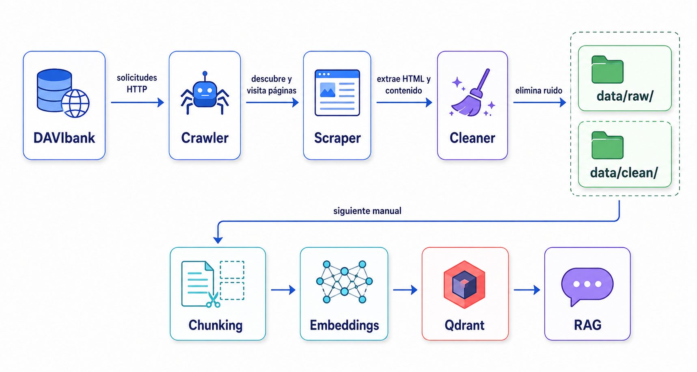
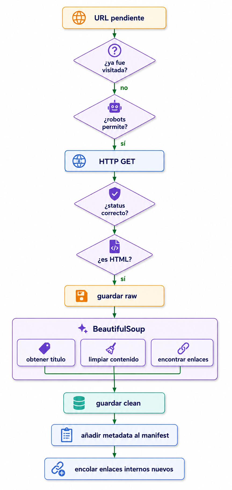

# Asistente RAG · Banca

Asistente conversacional (**RAG**) que responde preguntas sobre el contenido público de un sitio web bancario. Hace *web scraping* del sitio, vectoriza e indexa el contenido, y genera respuestas fundamentadas (*grounded*) con **memoria de conversación por sesión**. Arquitectura desacoplada, proveedores intercambiables y patrones de diseño documentados.

## Características (mapeadas a los requisitos)

- **Web scraping** que guarda el contenido **crudo** (HTML) y **limpio** (Markdown), respetando `robots.txt`.
- **Vectorización e indexado** con embeddings multilingües en una base vectorial.
- **Interfaz conversacional**: API REST (FastAPI) + frontend React.
- **Memoria por sesión**: usa los **últimos N mensajes** (N configurable) y **persiste** el historial.
- **Analítica** del historial de conversaciones (`GET /metrics`).
- **Patrones de diseño** documentados (Strategy, Factory, Facade, Repository).
- **Configuración por `.env`**, **reranker** opcional y **manejo de errores** (bonus).
- **Docker / docker-compose**.

## Arquitectura

Diseño desacoplado: la interfaz (API/UI) llama a un **núcleo RAG independiente del framework**, con proveedores de LLM, embeddings y vector store intercambiables.



**Flujo de una consulta:**
1. La UI (React) envía la pregunta y un `session_id` a la API.
2. La API valida (Pydantic) y delega en el `RAGService`.
3. El servicio: *embed* de la pregunta → búsqueda en Qdrant → (reranker) → arma el prompt con el contexto y los últimos N mensajes → LLM (Ollama) → respuesta + fuentes.
4. Se **persiste** el turno (usuario + asistente) en SQLite.

**Pipeline de ingesta e indexado** (del sitio a la base vectorial):



## Patrones de diseño

| Patrón | Dónde | Para qué |
|---|---|---|
| **Strategy** | `src/providers/base.py` + implementaciones | Interfaces para LLM, embeddings y vector store: cada tecnología es una estrategia intercambiable. |
| **Factory** | `src/providers/factory.py` | Crea la implementación correcta según `.env`, sin que el resto del código sepa cuál. |
| **Facade** | `src/core/rag_service.py` | `RAGService.answer()` esconde toda la orquestación tras un método simple. |
| **Repository** | `src/repositories/conversation_repository.py` | Aísla la persistencia del historial; el núcleo no sabe que debajo hay SQLite. |

Estos patrones son los que permiten cambiar Ollama por Bedrock, o Qdrant por OpenSearch, tocando solo la *factory* y una clase — sin tocar la API ni la UI.

## Stack y por qué

- **Python 3.11+**
- **FastAPI** — API tipada, validación con Pydantic y Swagger automático.
- **Qdrant** — base de datos vectorial (distancia coseno).
- **sentence-transformers** con **`intfloat/multilingual-e5-base`** — embeddings multilingües (contenido en español).
- **Ollama** con **`qwen2.5:3b`** — LLM local, gratis y self-hosted (proveedor intercambiable).
- **CrossEncoder `bge-reranker-v2-m3`** — reranker opcional (recuperación en dos etapas).
- **SQLite** — persistencia del historial.
- **React (Vite)** — frontend de chat.
- **Docker / docker-compose**.

Todo el núcleo es **gratis y self-hosted**; el diseño con Strategy permite mapear cada pieza a AWS (ver [Equivalencia en AWS](#equivalencia-en-aws)).

## Fuente de datos

El sitio objetivo original (BBVA Colombia) está protegido por un WAF anti-bot que responde `403` a toda petición programática, incluido `robots.txt`. La prueba permite usar otro banco, por lo que se seleccionó **Scotiabank Colpatria**: su sitio es *server-rendered* y su `robots.txt` permite el crawling de las páginas informativas (solo bloquea directorios de infraestructura). El scraper **respeta `robots.txt`**. Detalle y evidencia reproducible en [docs/decisiones.md](docs/decisiones.md).

> Scotiabank Colpatria pasó a llamarse **DAVIbank** (tras su integración con Davivienda), por lo que el contenido scrapeado y las respuestas del asistente aparecen con esa marca.

**Lógica del scraper** (respeta `robots.txt`, BFS del dominio, guarda crudo + limpio y encola enlaces internos):



## Estructura del proyecto

```
src/
  ingestion/     scraper, chunker, indexer
  providers/     Strategy + Factory (embeddings, vector store, llm, reranker)
  core/          RAGService (Facade)
  repositories/  ConversationRepository (Repository)
  analytics/     métricas del historial
  api/           FastAPI (endpoints, schemas)
frontend/        React + Vite (UI de chat)
tests/           pruebas unitarias (pytest)
data/            raw (HTML) + clean (Markdown) + sqlite
docs/            decisiones (ADR) y diagrama
```

## Puesta en marcha

### Requisitos
- Docker y Docker Compose
- Para desarrollo local: Python 3.11+ y Node 18+

### Opción A — Docker (un comando)

```bash
docker compose up --build
```

Levanta Qdrant, Ollama (con **descarga automática del modelo**), **indexa una muestra del contenido ya scrapeado** (incluida en el repo, para que funcione sin conexión) y expone la API y el frontend. No requiere `.env`: la configuración por defecto ya apunta a los servicios del compose.

- Frontend: http://localhost:5173
- API / Swagger: http://localhost:8000/docs

> El primer arranque descarga modelos (Ollama, embeddings, reranker); puede tardar varios minutos.

### Opción B — Desarrollo local

```bash
# 1. Infraestructura
cp .env.example .env
docker compose up -d qdrant ollama
docker compose exec ollama ollama pull qwen2.5:3b

# 2. Backend
python -m venv .venv && source .venv/bin/activate
pip install -r requirements.txt
python -m src.ingestion.scraper                                   # genera data/raw + data/clean
QDRANT_URL=http://localhost:6333 python -m src.ingestion.indexer  # indexa
QDRANT_URL=http://localhost:6333 OLLAMA_BASE_URL=http://localhost:11434 \
  uvicorn src.api.main:app --port 8000

# 3. Frontend (otra terminal)
cd frontend && npm install && npm run dev
```

## Uso

### API

- `POST /chat` — pregunta al asistente (mantén el mismo `session_id` para conservar el contexto):
  ```bash
  curl -X POST http://localhost:8000/chat -H "Content-Type: application/json" \
    -d '{"question":"¿Qué cuentas de ahorro ofrece?","session_id":"demo"}'
  ```
  Respuesta: `{ "answer": "...", "sources": ["..."], "session_id": "demo" }`
- `GET /metrics` — analítica del historial.
- `GET /health` — estado del servicio.
- `GET /docs` — documentación interactiva (Swagger).

### CLI

```bash
python -m src.core.rag_service "¿Qué productos ofrece el banco?"
```

## Pruebas

Pruebas unitarias (chunking, repositorio, métricas, config, schemas, factory), sin necesidad de servicios:

```bash
pip install -r requirements-dev.txt
pytest tests/ -v
```

## Configuración (`.env`)

| Variable | Descripción |
|---|---|
| `LLM_PROVIDER`, `LLM_MODEL`, `OLLAMA_BASE_URL` | proveedor y modelo del LLM |
| `EMBEDDINGS_MODEL` | modelo de embeddings |
| `VECTOR_STORE`, `QDRANT_URL`, `COLLECTION_NAME` | base vectorial |
| `CHUNK_SIZE`, `CHUNK_OVERLAP`, `TOP_K` | parámetros de RAG |
| `RERANKER_ENABLED`, `RERANKER_MODEL` | reranker (bonus) |
| `HISTORY_N` | nº de mensajes previos que entran al contexto (memoria) |
| `DB_PATH` | ruta de la base del historial |
| `CORS_ORIGINS` | orígenes permitidos por la API |

## Analítica

`GET /metrics` recorre el historial y calcula: número de sesiones y mensajes, preguntas/respuestas, promedios de longitud, **tasa de respuestas "no sé"** (proxy de *grounding*), **latencia media y máxima** de respuesta y **volumen por día**. Lee del mismo Repository que la memoria, así que es agnóstica del motor de persistencia. En el frontend, la pestaña **Métricas** muestra estos indicadores.

## Despliegue en free tier (opcional)

El núcleo es self-hosted, pero gracias al patrón **Strategy** se despliega en free tier **cambiando solo proveedores por `.env`**, sin tocar el código:

- **LLM:** Ollama → **Groq** (`LLM_PROVIDER=openai`, API compatible con OpenAI, gratis y sin tarjeta).
- **Vector store:** Qdrant local → **Qdrant Cloud** (free 1 GB, vía `QDRANT_API_KEY`).
- **API:** **Render** (`render.yaml`). **Frontend:** **Vercel** (`frontend/vercel.json`).

Pasos:
1. **Qdrant Cloud** — crea un cluster free; copia su URL + API key. Indexa contra él desde tu máquina:
   ```bash
   QDRANT_URL=<cloud-url> QDRANT_API_KEY=<key> python -m src.ingestion.indexer
   ```
2. **Groq** — genera una API key gratis en console.groq.com.
3. **API en Render** — conecta el repo (usa `render.yaml`) y define las envs `LLM_API_KEY`, `QDRANT_URL`, `QDRANT_API_KEY` y `CORS_ORIGINS` (la URL del frontend).
4. **Frontend en Vercel** — importa la carpeta `frontend/` y define `VITE_API_URL` con la URL de la API en Render.

> **Nota honesta (embeddings):** el modelo e5 (~1 GB con torch) no cabe en la RAM del free tier de Render (512 MB). Opciones: una instancia con ≥1 GB, un modelo de embeddings más pequeño, o una **API de embeddings hosted** (mismo patrón Strategy). Aquí se deja la **configuración y la guía**; el despliegue en vivo queda como paso siguiente.

## Limitaciones conocidas y mejoras futuras

- **Latencia**: el LLM y el reranker corren en **CPU** (Ollama en Docker no usa la GPU de Apple), ~1–2 min por respuesta (**cuantificada en `/metrics`**). Para un demo fluido, correr **Ollama nativo (Metal)**; para producción, apuntar el proveedor a una API/GPU (Bedrock) vía Strategy.
- **Fuentes** = *slug* de la página; una mejora es exponer la URL completa (guardarla en el *payload* al indexar).
- **Reranker**: mejora la calidad a costa de latencia; se desactiva con `RERANKER_ENABLED=false`.
- **Métrica de grounding** por heurística de texto; lo robusto sería marcar la respuesta al generar o evaluar con un juez (LLM-as-judge).
- **Escalado**: SQLite y el cálculo on-demand de métricas sirven para este alcance; con volumen, migrar a Postgres/DynamoDB (el Repository lo aísla) y materializar las métricas.

## Equivalencia en AWS

El diseño desacoplado permite reconstruir el sistema en AWS mapeando cada pieza:

| Este proyecto | AWS |
|---|---|
| Ollama (`qwen2.5`) | Amazon Bedrock (Claude/Nova) |
| e5 embeddings | Titan Text Embeddings |
| Qdrant | OpenSearch Serverless / S3 Vectors |
| SQLite (Repository) | DynamoDB |
| FastAPI | API Gateway + Lambda / ECS |
| Frontend React | S3 + CloudFront |
| docker-compose | ECS / Fargate |
